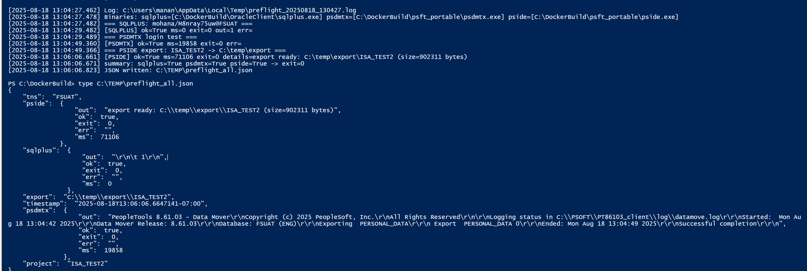
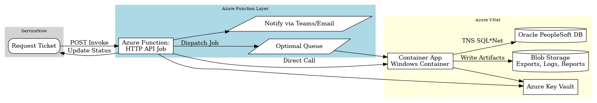
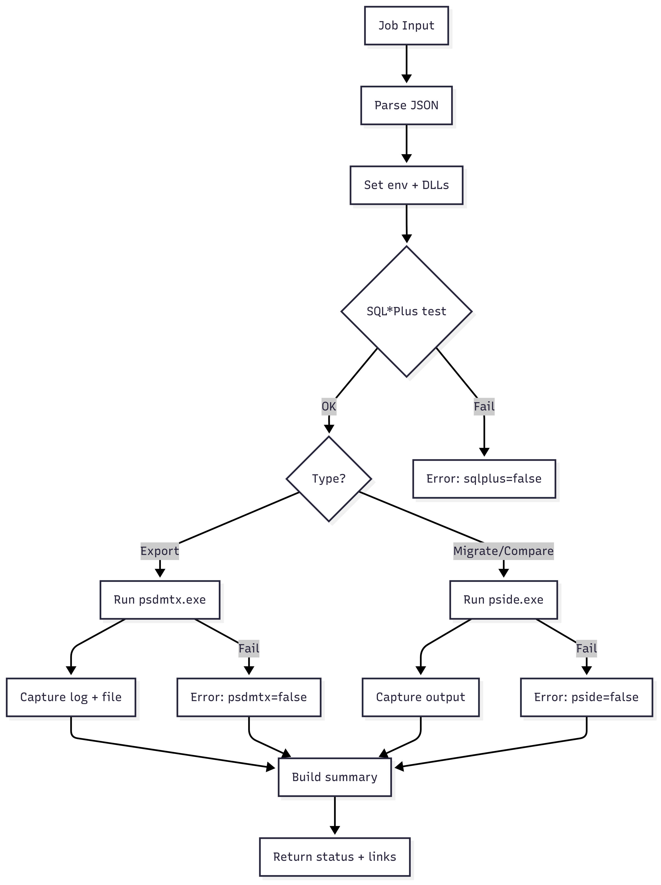
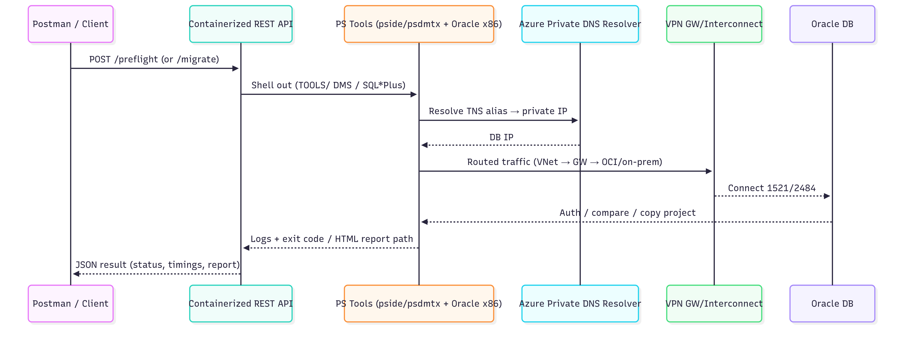

# 🚀 ERP Migration in a Container

A proof-of-concept showing how to run **PeopleSoft migration tools inside a container**.  
This project wraps Oracle client DLLs and PeopleSoft executables into a repeatable, testable workflow.
 
---

## 🔑 Key Features
- ✅ **Preflight checks** before running migrations  -  
      Example of the output    -
---
## 🖼 Architecture & Flow

### Overall Flow

### Preflight Logic

### Networking Flow

---
1) Minimal Oracle client files (x86 for PeopleSoft tools)
If you need SQLPLUS working then you might need more files from here.https://www.oracle.com/database/technologies/instant-client/winx64-64-downloads.html
but if you are looking for just pside.exe and psdmtx.exe then just these are good.

├─ oci.dll
├─ oraociei19.dll
└─ oraons.dll.
 
2) SQL*Net config (so Database name gets resolved)

Create the network admin folder and drop your tnsnames.ora and sqlnet.ora:
OracleClient/
└─ Network/
   └─ Admin/
      ├─ tnsnames.ora
      └─ sqlnet.ora  
3) Peoplesoft DLLs needed - I copied all the files in this folder Tools (8.61)
   
   └─ psft/
     └─ Bin/
       └─ Client/
         ├─ win86 /
           ─ All Files ( Maybe do not need all but for demo I used all)
   
5) Environment variables

Point SQL*Net at your network admin folder and ensure the client DLLs are on PATH.
PowerShell (local or inside container entrypoint):
$env:TNS_ADMIN = "C:\OracleClient\Network\Admin"
$env:PATH = "C:\OracleClient;$env:PATH"

5) Sanity test -   
If you get ORA-12154, check:

TNS_ADMIN points to the folder containing tnsnames.ora
Alias  is spelled exactly the same in tnsnames.ora and your connect string
No BOM/encoding issues (save as ANSI/UTF-8 without BOM)
No stray quotes or hidden characters in tnsnames.ora
The client you’re using (x86 vs x64) matches the process you’re launching

5) 
Notes on Runtime Performance
pside.exe is fully supported inside the container.
On slow VPN connections, it may take several minutes (I tested up to 3 minutes) but it always completes successfully.
This behavior depends on where the container is running on the network relative to the Oracle DB.
If you encounter slow response times, increase the timeout in your sqlnet.ora:

SQLNET.OUTBOUND_CONNECT_TIMEOUT = 300
SQLNET.RECV_TIMEOUT             = 300
SQLNET.SEND_TIMEOUT             = 300

(values in seconds; adjust higher if your VPN is extremely slow)
Check if the firewall is blocking the calls.

6) Dockerfile hints (Windows container) 

